**Student Management System**

- A full-stack student management student using spring Boot(java) for backend and HTML, CSS, JS, BOOTSTRAP for frontend.
- It allows user to add, view, update, delete and search a student records stored in PostgreSQL database.

**Features**

- Add new student records
- Edit and update existing student information
- Delete student records
- Search student by ID
- View all students in a tabular format
- Responsive UI built with Bootstrap 5

**Tech Stack**

1.Frontend:
- HTML5, CSS3, JavaScript (ES6)
- Bootstrap 

2.Backend:
- Java 21
- Spring Boot 
- Spring Web (REST API)
- Spring JDBC / JdbcTemplate

3.Database:
- PostgreSQL

4.Tools:
- Eclipse IDE
- Apache Tomcat (embedded in Spring Boot)
- Maven for dependency management
	
**Project Structure**
	
Student_Management_Springboot/\
│\
├── src/main/java/com/example/studentmanagement/\  
│   ├── controller/\
│   │   └── StudentController.java\  
│   ├── dao/\
│   │   ├── StudentDao.java\
│   │   └── StudentDaoImplementation.java\
│   ├── model/\
│   │   └── Student.java\
│   ├── service/\
│   │   └── StudentService.java\
│   |	└── StudentServiceImplementation.java\
│   ├── exception/\
│   |	└── ResourceNotFoundException.java \
│   │   └── GlobalExceptionHandler.java\
│   └── StudentmanagementApplication.java\
│\
├── src/main/resources/\
│   ├── application.properties\
│   └── static/\
│       ├── index.html\
|		├── add-student.html\
|		├── delete-student.html\
|		├── search-student.html\
|		├── update-student.html\
|		├── view-students.html\
|		└── js/\
│       |   └── app.js\
│       └── css/\
│           └── style.css\
|\
├── src/test/java/com/example/studentmanagement/\  
|	├── controller/\
│   │   └── StudentControllerTests.java\  
│   ├── service/\
│   |	└── StudentServiceImplementationTests.java\
│   └── StudentmanagementApplicationTests.java\
│\
└── images/
|   ├── AddStudentForm.png\
|	├── DeleteStudent.png\
|	├── FindById.png\
|	├── FindByIdOutput.png\
|	├── Homepage.png\
|	├── NostudentFoundToDelete.png\
|	├── StudentAdded.png\
|	├── UpdateStudentForm.png\
|	└──ViewAllStudent.png\
└── pom.xml

**Setup Instructions**

1️⃣ Prerequisites
- Java 17 or later
- PostgreSQL installed and running
- Eclipse IDE or IntelliJ IDEA
- Maven

2️⃣ Create Database
- Run this SQL in PostgreSQL:

  	CREATE DATABASE DATABASE_NAME;\
  
  	CREATE TABLE TABLE_NAME (\
  		id SERIAL PRIMARY KEY,\
  		name VARCHAR(255) NOT NULL,\
 		course VARCHAR(255) NOT NULL,\
 		email VARCHAR(255) NOT NULL UNIQUE,\
 		ph_no VARCHAR(15) NOT NULL,\
 		address VARCHAR(255)\
  	);
	
3️⃣ Configure Database in application.properties

	spring.application.name=studentmanagement
	spring.datasource.url=jdbc:postgresql://localhost:5432/YOUR_DATABASE_NAME
	spring.datasource.username= YOUR_USERNAME
	spring.datasource.password = YOUR_PASSWORD
	spring.datasource.driver-class-name=org.postgresql.Driver
	
	spring.jpa.show-sql= true
	logging.level.org.springframework.jdbc.core=DEBUG
	
	logging.level.org.springframework.jdbc.core.JdbcTemplate=DEBUG
	logging.level.org.springframework.jdbc.core.StatementCreatorUtils=TRACE
	
4️⃣ Build and Run the Application
- In Eclipse:
	Right-click the project → Run As → Spring Boot App

- Or using terminal:
	mvn spring-boot:run

- App will run at:
	http://localhost:8080

5️⃣ Access Frontend
- Open the file:
	src/main/resources/static/index.html

- Or visit directly in the browser:
	http://localhost:8080/index.html
	
**API Endpoints**

| Method | Endpoint           | Description       |
| ------ | ------------------ | ----------------- |
| GET    | /api/students      | Get all students  |
| GET    | /api/students/{id} | Get student by ID |
| POST   | /api/students      | Add new student   |
| PUT    | /api/students/{id} | Update student    |
| DELETE | /api/students/{id} | Delete student    |
	
**Frontend Overview**

index.html:\
	- Main page with navigation bar.\
	- Contains visually styled cards to access each module.\
	- Uses Bootstrap for responsive design and gradient background.\

add-student.html\
	- Form to add a new student.\
	- Fields: Name, Course, Email, Phone No, Address.\
	- On clicking “Add Student”, data is sent to backend using Fetch API (POST method).\

view-students.html\
	- Displays all students in a Bootstrap table.\
	- Fetches data from backend using GET request.\
	- Each row has “Edit” and “Delete” buttons.\

update-student.html\
	- Form to update an existing student’s details.\
	- Pre-fills student data when selected from the table.\
	- Sends updated data to backend using PUT method.\

delete-student.html\
	- Allows deleting a student by ID.\
	- Sends delete request to backend using DELETE method.\

search-student.html\
	- Lets you search a student by their ID.\
	- Displays details in a card format.\

app.js:\
	- Handles API calls to Spring Boot backend.\

Functions:
| Function              | Purpose                                               |
| --------------------- | ----------------------------------------------------- |
| **fetchStudents()**   | Loads and displays all students (GET).                |
| **addStudent()**      | Adds a new student (POST).                            | 
| **updateStudent()**   | Updates existing student info (PUT).                  |
| **deleteStudent(id)** | Deletes a student by ID (DELETE).                     |
| **findStudentById()** | Searches and displays student by ID (GET by ID).      |
| **resetForm()**       | Clears input fields after add/update.                 |

**Screenshots**

**Home Page**

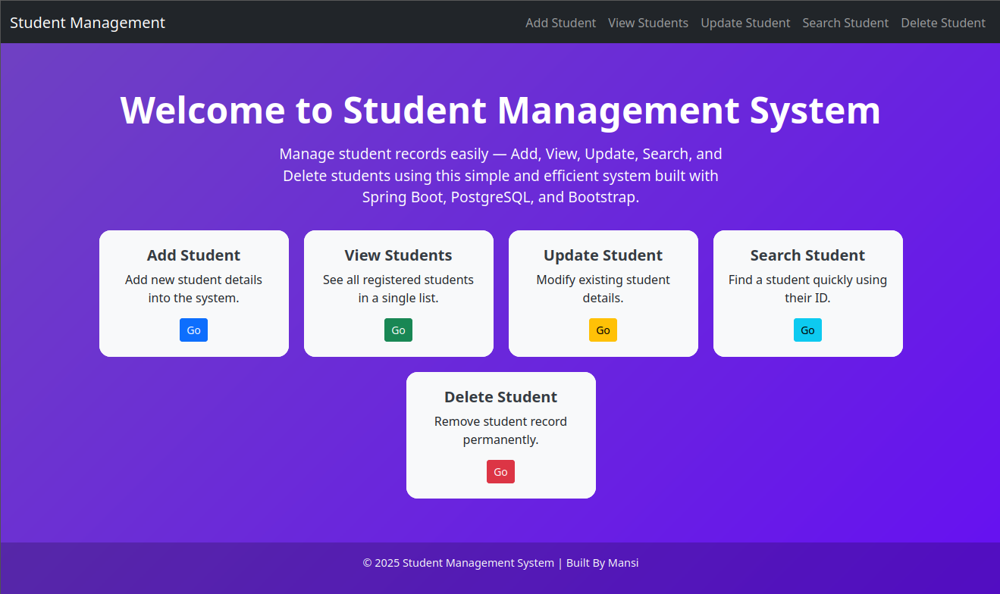

**Add Student:**

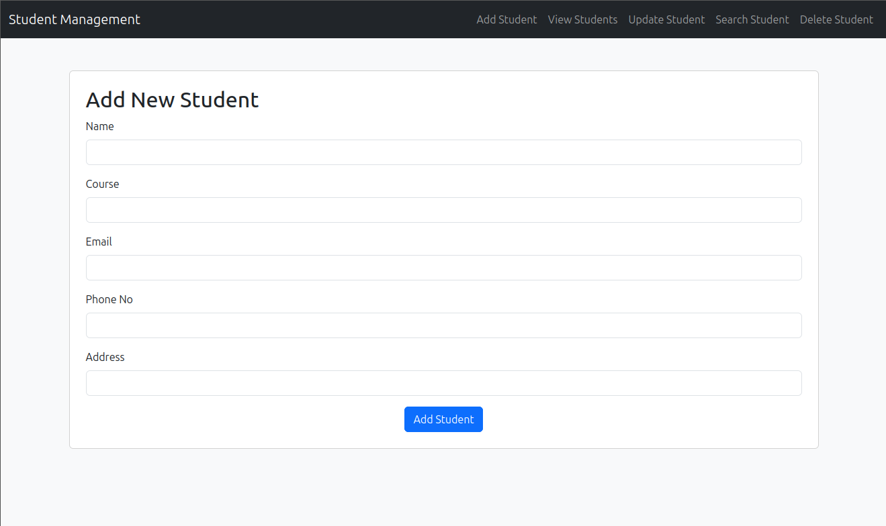

**Student Added Successfully:**

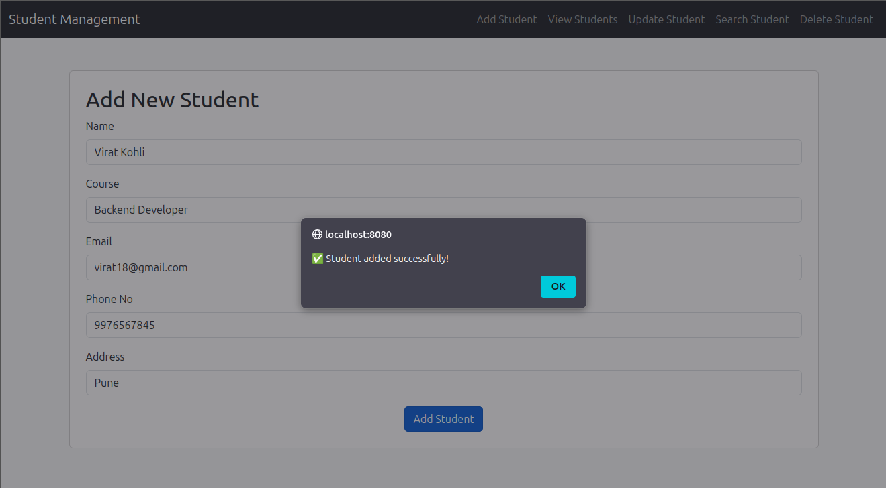

**Delete Student:**

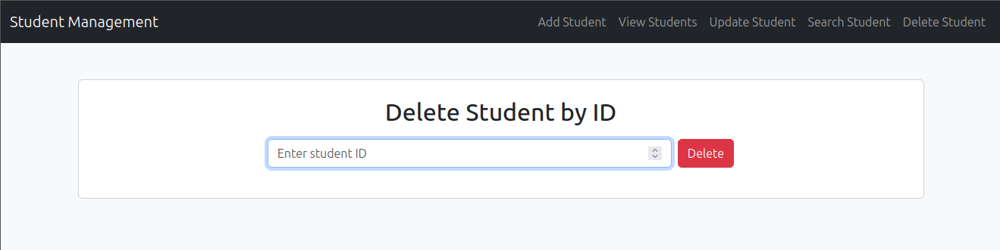

**FindById:**

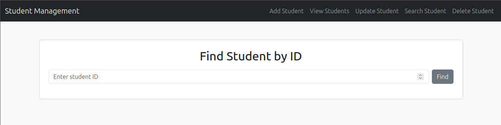

**Found Student By Id:**

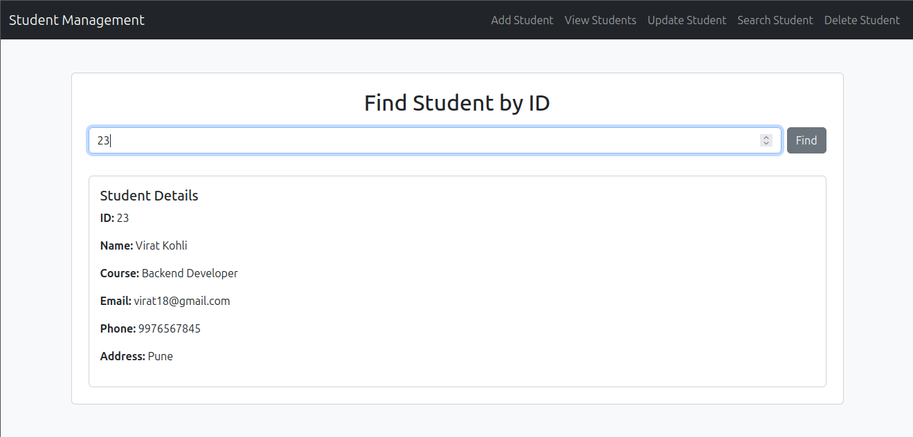

**Student Not Found:**

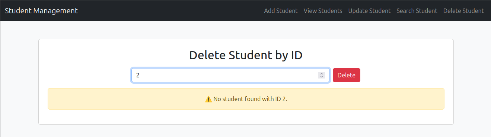

**Update Student Details:** 

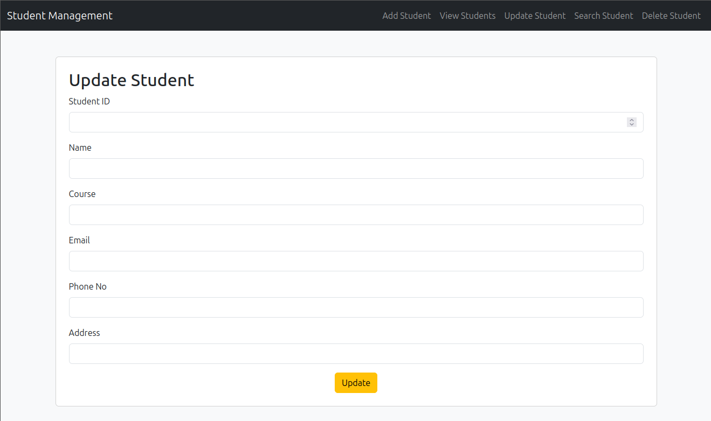

**View Students:**

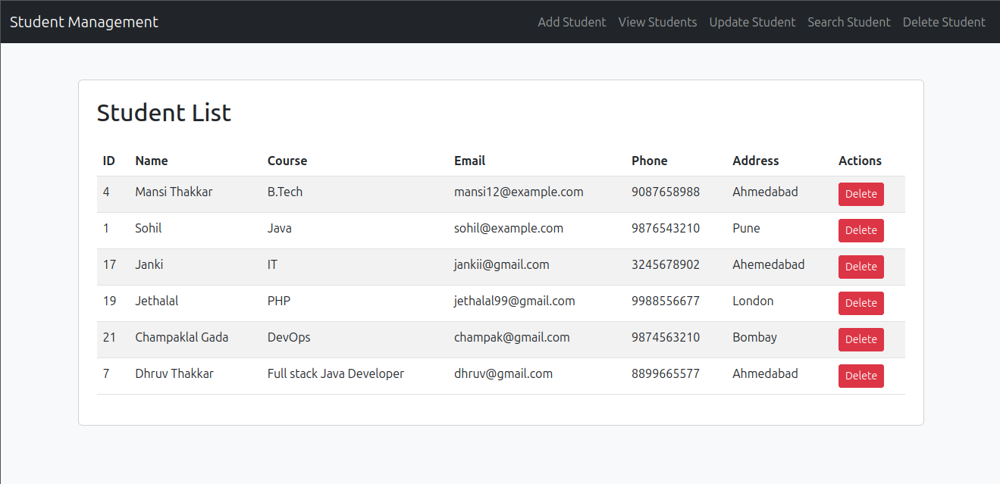

**Service class Test Cases**

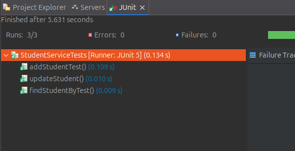

**Controller Test cases**

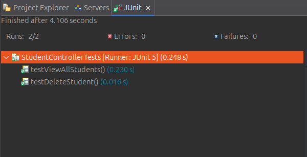

**Author**

Mansi Thakkar\
📧 mthakkar@logilite.com\
💼 Project based on Java + Spring Boot + PostgreSQL + JS stack	